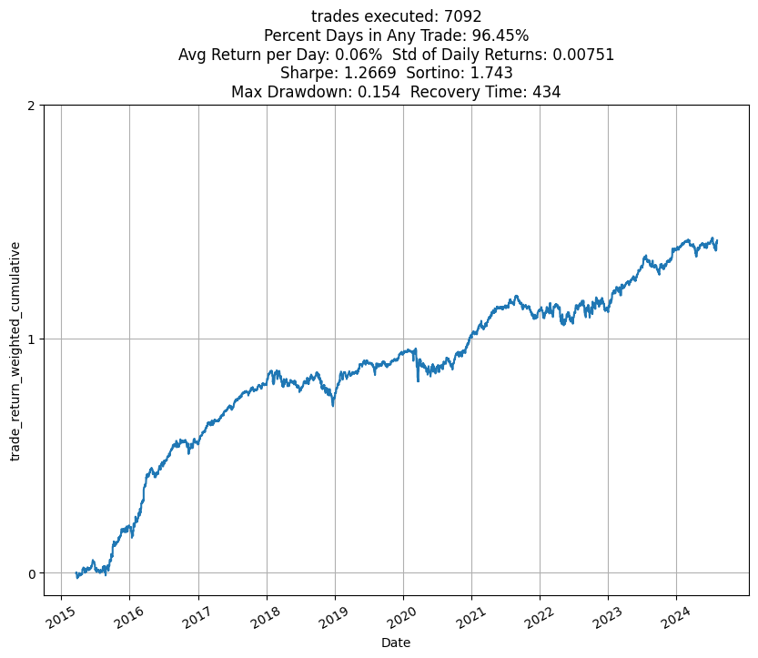

<h1 align="center" style="font-weight: bold;">Stock Backtester</h1>

  <align="center">A flexible python module for backtesting rule-based stock trading strategies 

    

## Framework

Defining a trading strategy using this framework involves six main steps:

1. #### Provide a list of ticker symbols to be considered in the backtest.
2. #### Provide primary filters to restrict possible trades to only those satisfying defined criteria. Primary filters include...
    * `VolumeFilter`: Specify the minimum volume a ticker must have on that day (or previous days) for a trade to be considered possible.
    * `WeekdayFilter`: User specifies which days of the week trades should be considered on.
    - `UpDayFilter`: User specifies if, for example, a ticker should be bought at close only if it closed higher than it opened (or vice versa) that day. Or if a ticker should be bought at open only if the it closed higher than it opened (or vice versa) on the previous day.
3. #### Designate which of the above filters apply to entering a trade and which apply to exiting a trade.
    - `EntryFilter`: Accepts as arguments the tickerdata object defined in step 1, and relevant filters defined in step 2.
    - `ExitFilter`: Accepts as arguments the tickerdata object defined in step 1, and relevant filters defined in step 2.
4. #### Provide secondary filters to restrict trades based on ticker performance under the primary filters strategy so far. For example...
    - `CumReturnFilter`: Trades only those tickers who are among the top m tickers in terms of cumulative return over the past d days under the primary filter strategy.
    - `StdDevFilter`: Same idea as CumReturnFilter except for smallest m standard deviations.
    - `SharpeFilter`: Same idea except for top X Sharpe tickers.
5. #### Into a `Strategy` object, combine the secondary filters with info about when to enter/exit trades, min hold time, whether to go short/long.
6. #### Into a `BackTest` object, combine the Entry and Exit filter objects from step 3 along with the Strategy object from step 5. Contains methods for obtaining a summary and plots of the strategy's performance.

The module has much more functionality than was demonstrated in the short blurb above. For more complex use cases, see the example code section of this repository.

